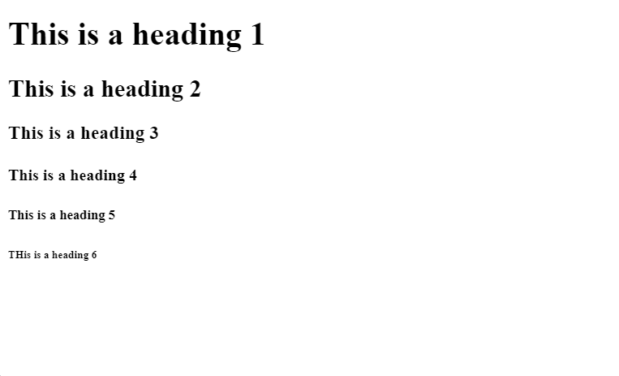

# Headings and Paragraphs

There are 6 types of headings in HTML - `h1` through `h6`

`h1` being the biggest and `h6` being the smallest

Here's a picture of how they would look

Note: When using headings in a webpage don't use headings based on size, use them based on a heirarchy, so like as subtopics. The size can be changed later with CSS.

# Extra: Paragraphs

Paragraphs are made with the `
` tag

Here's a picture of how they would look

