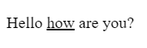

# Text Styling

You can style text in HTML in multiple different ways, you can make it bold, italicized, underlined, striketrough, superscript and subscript.
___
## Bold 
You can do bold in two ways, the `<b>` tag or the `<strong>` tag, in terms of HTML semantics you should use `<strong>`

Here's how it would look rendered on a webpage

Code:

```html
<p>Hello <strong>how</strong> are you?</p>
```

Output:


**Look [here](https://developer.mozilla.org/en-US/docs/Web/HTML/Element#inline_text_semantics) for more information about HTML Semantics**
___
## Italics
You can do Italics thrrough two tags, the `<i>` tag or the `<em>` tag, and `<em>` is semanticaly correct.

Here's how some italicized text would look on a webpage

Code:

```html
<p>Hello <em>how</em> are you?</p>
```

Output:


___
## Underlined
You can make text underlined through the `<u>` tag or the `<ins>`, but later on with CSS, there is a better way of making text underlined.

Example of underlined Text

Code:

```html
<p>Hello <ins>how</ins> are you?</p>
```

Output:


___
## Strikethrough
Strikethrough text can be made with three tags, the `<strike>` tag, the `<s>` tag, and the `<del>` tag. The `<del>` tag is the most semanticaly correct.

Example

Code:

```html
<p>Hello <del>how</del> are you?</p>
```

Output:


___
# Superscript and Subscript
Super Script and Subscript are done through the `<sub>` and `<sup>` tags.

Example

Code:

```html
<p>Hello <sup>how</sup> <sub>are</sub> you?</p>
```

Output:


# Extra: Nesting

One of the most error prone things in HTML is incorrect nesting, and it goes when people put ending tags in the wrong order, here is an example of an incorrect nesting

```html
<p>Lorem ipsum dolor sit amet consectetur adipisicing elit. Rerum asperiores itaque <strong>pariatur corrupti ratione, eius accusantium saepe nesciunt, unde consequatur nemo esse dolores sequi vero tempore praesentium autem id maiores.</p></strong>
```
The ending `<strong>` tag should come before the ending `<p>` tag.

# [NEXT]()