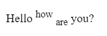

# Text Styling

**Topics Covered**
* Bold
* Italics
* Underlined
* Strikethrough
* Superscript and Subscript
* Extra: Nesting

You can style text in HTML in multiple different ways, you can make it bold, italicized, underlined, striketrough, superscript and subscript.
## Bold 
You can do bold in two ways, the `<b>` tag or the `<strong>` tag, in terms of HTML semantics you should use `<strong>`. `<strong>` is generally used when you want something to come out important and `<b>` is used to just have bold text.  

Here's how it would look rendered on a webpage

Code:
```html
<p>Hello <strong>how</strong> are you?</p>
```
Output:


**Look [here](https://developer.mozilla.org/en-US/docs/Web/HTML/Element#inline_text_semantics) for more information about HTML Semantics**
## Italics
You can do Italics through two tags, the `<i>` tag or the `<em>` tag, and `<em>` is semantically correct. `<em>` is used when you want emphasized text and `<i>` is used for just having italicized text.

Here's how some italicized text would look on a webpage

Code:

```html
<p>Hello <em>how</em> are you?</p>
```

Output:


## Underlined
You can make text underlined through the `<u>` tag or the `<ins>`, but later on with CSS, there is a better way of making text underlined. `<ins>` is generally used when trying to show inserted text, an the `<u>` tag is used when just trying to get underlined text. 

Example of underlined Text

Code:

```html
<p>Hello <ins>how</ins> are you?</p>
```
Output:


## Strikethrough
Strikethrough text can be made with three tags, the `<strike>` tag, the `<s>` tag, and the `<del>` tag. The `<del>` tag is the most semantically correct. The `<del>` tag is used when trying trying to show deleted text and `<s>` and `<strike>` are used when just simply wanting strikethrought text.

Example

Code:

```html
<p>Hello <del>how</del> are you?</p>
```
Output:


## Superscript and Subscript
Superscript and Subscript are done through the `<sup>...</sup>` and `<sub>...</sub>` elements.

Example

Code:

```html
<p>Hello <sup>how</sup> <sub>are</sub> you?</p>
```

Output:



## Extra: Nesting

One of the most error-prone things in HTML is incorrect nesting, and it happens when people put ending tags in the wrong order, here is an example of an incorrect nesting

```html
<p>Lorem ipsum dolor sit amet consectetur adipisicing elit. Rerum asperiores itaque <strong>pariatur corrupti ratione, eius accusantium saepe nesciunt, unde consequatur nemo esse dolores sequi vero tempore praesentium autem id maiores.</p></strong>
```
The ending `</strong>` tag should come before the ending `</p>` tag.

# [PREVIOUS](3.%20lists.md) [NEXT](5.%20attributes.md)